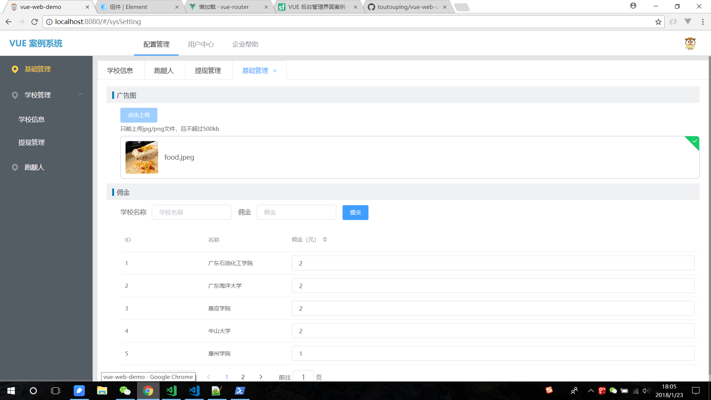

## vue-web-demo
vue 实现网页版前端框架搭建，只需在此基础上增加独立组件，便可很快速开发一个完善的后台管理系统。

## 主要功能
> 登录退出功能

> 国际化中英文界面切换

> 动态菜单列表

> 通过动态页签增减实现组件切换展示

> 路由切换菜单功能

## 效果展示




## 技术栈
> [vue.js](https://cn.vuejs.org/) 构建用户界面的 MVVM 框架，核心思想是：数据驱动、组件系统。

> [vue-cli](https://www.npmjs.com/package/vue-cli) 是vue的脚手架工具，目录结构、本地调试、代码部署、热加载、单元测试。

> [vue-router](https://router.vuejs.org/zh-cn/) 是官方提供的路由器，使用vue.js构建单页面应用程序变得轻而易举。

> [vue-resource](https://www.npmjs.com/package/vue-resource) 请求数据，服务器通讯。

> [vuex](https://vuex.vuejs.org/zh-cn/) 是一个专为 vue.js 应用程序开发的状态管理模式，简单来说Vuex就是管理数据的。

> [Element](http://element-cn.eleme.io/#/zh-CN) 一套为开发者、设计师和产品经理准备的基于 Vue 2.0 的桌面端组件库

> [Vue-progressbar](http://hilongjw.github.io/vue-progressbar/) 进度条组件。

> [vue-i18n](https://kazupon.github.io/vue-i18n/) 国际化资源管理组件。


> A Vue.js project

## Build Setup

``` bash
# install dependencies
npm install

# serve with hot reload at localhost:8080
npm run dev

# build for production with minification
npm run build

# build for production and view the bundle analyzer report
npm run build --report

# run unit tests
npm run unit

# run all tests
npm test
```

## 项目组织架构
>├─ .eslintrc.js  
>├─ index.html  
>├─ package.json // 配置文件  
>├─ README.md // 说明文件  
>├─ build // webpack打包执行文件  
>├─ config // webpack打包配置文件  
>├─ code-standards //编码规范  
>├─ src   
>│　　├─ main.js // webpack入口/项目启动入口  
>│　　├─ api // 存放api接口文件，服务层   
>│　　├─ common // 存放私有系统的公共样式、脚本、图片  
>│　　│　　├─ css  
>│　　│　　│　　└─ common.css // 公共样式  
>│　　│　　├─ img // 公共图片  
>│　　│　　├─ js  
>│　　│　　│　　├─ common.js // 公共脚本  
>│　　│　　│　　└─ utils.js // 工具类  
>│　　├─ config  
>│　　│　　├─ index.js // 共有配置文件  
>│　　├─ router  
>│　　│　　├─ index.js // 存放路由  
>│　　├─ views // 视图  
>│　　│　　├─ views.md  
>│　　├─ vuex // 这一块将存放于common项目  
>│　　│　　├─ index.js  
>│　　│　　├─ actions  
>│　　│　　├─ getters  
>│　　│　　└─ modules  

